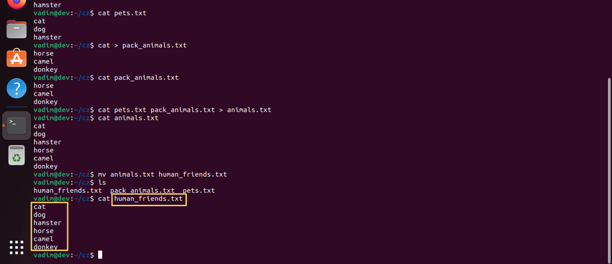
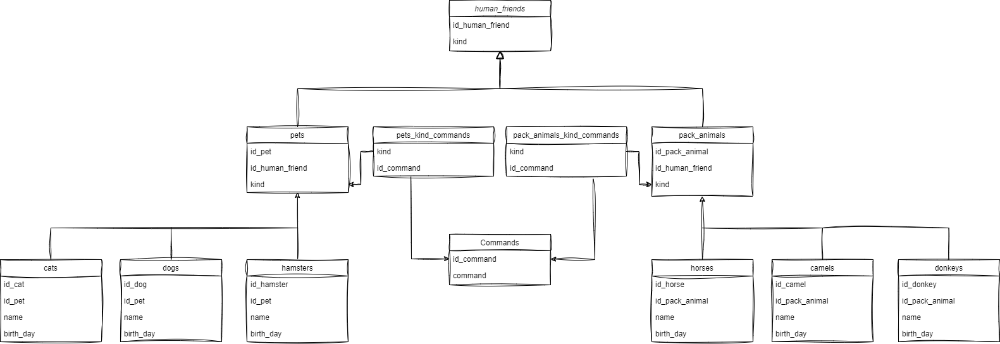
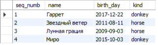
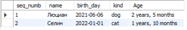
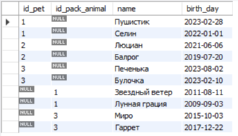

## Тимофеев Вадим, группа № 4334/4336/4338

### Итоговая контрольная работа по блоку специализация  
*Урок 2. Итоговая контрольная работа*

### Задания:

> `Задание 1.` Используя команду cat в терминале операционной системы Linux, создать два файла Домашние животные (заполнив файл собаками, кошками, хомяками) и Вьючные животными заполнив файл Лошадьми, верблюдами и ослы), а затем объединить их. Просмотреть содержимое созданного файла. Переименовать файл, дав ему новое имя (Друзья человека).  

```bash
mkdir cz  
cd cz  
ls  
cat > pets.txt  
# Ввожу в консоль:  
cat       
dog   
hamster  
# Нажимаю Ctrl + D для окончания ввода  
# Проверяю:  
cat pets.txt   
# Вывод:  
cat  
dog  
hamster  
cat > pack_animals.txt  
# Ввожу в коноль:  
horse  
camel  
donkey  
# Проверяю:  
cat pack_animals.txt   
# Вывод:  
horse  
camel  
donkey  
# Объединяю два файла в результирующий:  
cat pets.txt pack_animals.txt > animals.txt  
# Проверяю:  
cat animals.txt   
# Вывод:  
cat  
dog  
hamster  
horse  
camel  
donkey  
# Переименовываю файл:  
mv animals.txt human_friends.txt  
# Проверяю:  
ls  
# Вывод:  
human_friends.txt  pack_animals.txt  pets.txt  
```

 

> `Задание 2.` Создать директорию, переместить файл туда.  

  

> `Задание 3.` Подключить дополнительный репозиторий MySQL. Установить любой пакет из этого репозитория.  

wget https://dev.mysql.com/get/mysql-apt-config_0.8.12-1_all.deb

> `Задание 4.` Установить и удалить deb-пакет с помощью dpkg.

**Устанавливаю пакет с помоью dpkg:** 
```bash 
dpkg -i mysql-apt-config*  
```

**Удаляю пакет:**  
```bash
dpkg -r mysql-server-8.0  
``` 

> `Задание 5.` Выложить историю команд в терминале ubuntu  

**Вывожу крайние 40 команд:**  
```bash
history 40  
```

> `Задание 6.` Нарисовать диаграмму, в которой есть класс родительский класс, домашние животные и вьючные животные, в составы которых в случае домашних животных войдут классы: собаки, кошки, хомяки, а в класс вьючные животные войдут: Лошади, верблюды и ослы.  

 

> `Задание 7.` В подключенном MySQL репозитории создать базу данных “Друзья человека”  
```sql
create database human_friends;
use human_friends;
```

> `Задание 8.` Создать таблицы с иерархией из диаграммы в БД  

```sql

create database human_friends;
use human_friends;

CREATE TABLE human_friends
(
  id_human_friend INT PRIMARY KEY AUTO_INCREMENT,
  kind VARCHAR (40)
);

CREATE TABLE commands
(
  id_command INT PRIMARY KEY auto_increment,
  command VARCHAR (40) unique
);

CREATE TABLE pets
(
  id_pet INT PRIMARY KEY AUTO_INCREMENT,
  id_human_friend INT,
  kind VARCHAR (40) unique,
  FOREIGN KEY (id_human_friend) REFERENCES human_friends (id_human_friend) ON DELETE SET NULL
);

CREATE TABLE pack_animals
(
  id_pack_animal INT PRIMARY KEY AUTO_INCREMENT,
  id_human_friend INT,
  kind VARCHAR (40) unique,
  FOREIGN KEY (id_human_friend) REFERENCES human_friends (id_human_friend) ON DELETE SET NULL
);

CREATE TABLE pets_kind_commands
(
  kind VARCHAR (40),
  id_command INT,
  FOREIGN KEY (id_command) REFERENCES commands (id_command) ON DELETE cascade,
  foreign key (kind) references pets (kind) on delete cascade
);

CREATE TABLE pack_animals_kind_commands
(
  kind VARCHAR (40),
  id_command INT,
  FOREIGN KEY (id_command) REFERENCES commands (id_command) ON DELETE cascade,
  foreign key (kind) references pack_animals (kind) on delete cascade
);

CREATE TABLE cats
(
  id_cat INT PRIMARY KEY AUTO_INCREMENT,
  id_pet INT,
  name VARCHAR (40),
  birth_day DATE,
  FOREIGN KEY (id_pet) REFERENCES pets (id_pet) ON DELETE SET NULL
);

CREATE TABLE dogs
(
  id_dog INT PRIMARY KEY AUTO_INCREMENT,
  id_pet INT,
  name VARCHAR (40),
  birth_day DATE,
  FOREIGN KEY (id_pet) REFERENCES pets (id_pet) ON DELETE SET NULL
);

CREATE TABLE hamsters
(
  id_hamster INT PRIMARY KEY AUTO_INCREMENT,
  id_pet INT,
  name VARCHAR (40),
  birth_day DATE,
  FOREIGN KEY (id_pet) REFERENCES pets (id_pet) ON DELETE SET NULL
);

CREATE TABLE horses
(
  id_horse INT PRIMARY KEY AUTO_INCREMENT,
  id_pack_animal INT,
  name VARCHAR (40),
  birth_day DATE,
  FOREIGN KEY (id_pack_animal) REFERENCES pack_animals (id_pack_animal) ON DELETE SET NULL
);

CREATE TABLE camels
(
  id_camel INT PRIMARY KEY AUTO_INCREMENT,
  id_pack_animal INT,
  name VARCHAR (40),
  birth_day DATE,
  FOREIGN KEY (id_pack_animal) REFERENCES pack_animals (id_pack_animal) ON DELETE SET NULL
);

CREATE TABLE donkeys
(
  id_donkey INT PRIMARY KEY AUTO_INCREMENT,
  id_pack_animal INT,
  name VARCHAR (40),
  birth_day DATE,
  FOREIGN KEY (id_pack_animal) REFERENCES pack_animals (id_pack_animal) ON DELETE SET NULL
);

```

> `Задание 9.` Заполнить низкоуровневые таблицы именами(животных), командами
которые они выполняют и датами рождения  

Реляционные БД подразумевают связи между таблицами, поэтому чтобы заполнить низкоуровневые таблицы в полном объеме, необходимо заполнить все существующие таблицы.

```sql
INSERT INTO commands (command) VALUES ('Sleep'), ('Eat'),('Go'), ('Purr'), ('Bark');

insert into human_friends (kind) values ('pets'), ('pack_animals');

alter table pets alter column id_human_friend set default 1;

insert into pets (kind) values ('cat'), ('dog'), ('hamster');

# Проверяю pets
select * from pets;

alter table pack_animals alter column id_human_friend set default 2;

insert into pack_animals (kind) values ('horse'), ('camel'), ('donkey');

# Проверяю pack_animals
select * from pack_animals;

insert into pets_kind_commands (kind, id_command) values 
('cat', 1), ('cat', 2), ('cat', 3), ('cat', 4),
('dog', 1), ('dog', 2), ('dog', 3), ('dog', 5),
('hamster', 1), ('hamster', 2), ('hamster', 3);

insert into pack_animals_kind_commands (kind, id_command) values 
('horse', 1), ('horse', 2), ('horse', 3),
('camel', 1), ('camel', 2), ('camel', 3),
('donkey', 1), ('donkey', 2), ('donkey', 3);

# Проверяю
select * from pets_kind_commands;

# Проверяю
select * from pack_animals_kind_commands;

insert into cats (id_pet, name, birth_day) values 
(2, 'Пушистик', '2023-02-28'), 
(2, 'Селин', '2022-01-01');

# Проверяю котов
select * from cats;

insert into dogs (id_pet, name, birth_day) values 
(2, 'Люциан', '2021-06-06'), 
(2, 'Балрог', '2019-07-20');

# Проверяю собак
select * from dogs;

insert into hamsters (id_pet, name, birth_day) values 
(3, 'Печенька', '2023-08-02'), 
(3, 'Булочка', '2023-02-10');

# Проверяю хомечков
select * from hamsters;

insert into horses (id_pack_animal, name, birth_day) values 
(1, 'Звездный ветер', '2011-08-11'), 
(1, 'Лунная грация', '2009-09-03');

# Проверяю лошадей
select * from horses;

insert into camels (id_pack_animal, name, birth_day) values 
(2, 'Горбаш', '2001-05-18'), 
(2, 'Верблюжка', '2005-03-13');

# Проверяю верблюдов
select * from camels;

insert into donkeys (id_pack_animal, name, birth_day) values 
(3, 'Миро', '2015-10-03'), 
(3, 'Гаррет', '2017-12-22');

# Проверяю осликов
select * from donkeys;
```

> `Задание 10.` Удалив из таблицы верблюдов, т.к. верблюдов решили перевезти в другой
питомник на зимовку. Объединить таблицы лошади, и ослы в одну таблицу.  

```sql
truncate table camels;

# Проверяю верблюдов
select * from camels;

with hd as (select id_pack_animal, name, birth_day from horses UNION ALL select id_pack_animal, name, birth_day from donkeys)
select ROW_NUMBER() OVER (ORDER BY name) AS seq_numb, hd.name as name, hd.birth_day as birth_day, pa.kind as kind
from pack_animals as pa
right join hd
on hd.id_pack_animal = pa.id_pack_animal
; 
```

Результат запроса:




> `Задание 11.` Создать новую таблицу “молодые животные” в которую попадут все
животные старше 1 года, но младше 3 лет и в отдельном столбце с точностью
до месяца подсчитать возраст животных в новой таблице  

```sql
# Было интересно, получится ли в один запрос :) 

create table youth_animals 
with t as (with p_a as (with hd as (
select id_pack_animal, name, birth_day from horses 
UNION ALL 
select id_pack_animal, name, birth_day from donkeys)
select hd.name as name, hd.birth_day as birth_day, pa.kind as kind
from pack_animals as pa
right join hd
on hd.id_pack_animal = pa.id_pack_animal),
p_s as (with ps as (
select id_pet, name, birth_day from cats 
UNION ALL 
select id_pet, name, birth_day from dogs 
UNION ALL 
select id_pet, name, birth_day from hamsters)
select ps.name as name, ps.birth_day as birth_day, p.kind as kind
from pets as p
right join ps
on ps.id_pet = p.id_pet)
select * from p_a
union all
select * from p_s)
select ROW_NUMBER() OVER (ORDER BY name) as seq_numb, t.*, 
concat(FLOOR(datediff(CURDATE(), birth_day) /30/12), ' years, ', 
FLOOR(datediff(CURDATE(), birth_day) /30) - FLOOR(datediff(CURDATE(), birth_day) /30/12)*12, ' months') 
as Age from t
where FLOOR(datediff(CURDATE(), birth_day) /30/12) >= 1 and FLOOR(datediff(CURDATE(), birth_day) /30/12) <=3
;

# Проверяю вновь созданную таблицу:  
select * from youth_animals;
```
Результат выполнения запроса:  




> `Задание 12.` Объединить все таблицы в одну, при этом сохраняя поля, указывающие на прошлую принадлежность к старым таблицам.  

```sql
Select id_pet, null as id_pack_animal, name, birth_day from cats
UNION
Select id_pet, null as id_pack_animal, name, birth_day from dogs
UNION
Select id_pet, null as id_pack_animal, name, birth_day from hamsters
UNION
Select null as id_pet, id_pack_animal, name, birth_day from horses
UNION
Select null as id_pet, id_pack_animal, name, birth_day from donkeys;
```
Результат запроса:  



> `Задание 13.` Создать класс с Инкапсуляцией методов и наследованием по диаграмме.  

Задание выполнено в ходе написания кода программы

> `Задание 14.` Написать программу, имитирующую работу реестра домашних животных.
В программе должен быть реализован следующий функционал:
14.1 Завести новое животное
14.2 определять животное в правильный класс
14.3 увидеть список команд, которое выполняет животное
14.4 обучить животное новым командам
14.5 Реализовать навигацию по меню  

> `Задание 15.` Создайте класс Счетчик, у которого есть метод add(), увеличивающий̆
значение внутренней̆int переменной̆на 1 при нажатие “Завести новое
животное” Сделайте так, чтобы с объектом такого типа можно было работать в
блоке try-with-resources. Нужно бросить исключение, если работа с объектом
типа счетчик была не в ресурсном try и/или ресурс остался открыт. Значение
считать в ресурсе try, если при заведения животного заполнены все поля.

> Нужно избегать падения приложения, а не бросать исключение на каждом шагу. Введение не корректных данных в программе
обрабатывается без падения приложения (метод getNewAnimal в классе View), а именно повторной попыткой введения данных до тех пор, 
пока они не будут введены корректно. Вместо этого реализовано пробрасывание исключение в случае работы не в ресурсе счетчика при 
увеличении его значения (счетчик имплементирует интерфейс AutoCloseable, и при работе в ресурсоном трае падать не должен).

## Описание приложения:

При запуске происходит считывание информации из файла локальной базы данных, в которой хранится информация о животных
в json - формате в коллекцию в виде списка. (Если это первый запуск приложения на компьютере - такой файл будет создан). 
Далее работа будет происходить со списком. Пользователь, при желании, может сохранить данные. При этом происходит
пересохранение всех данных из коллекции в локальный файл базы данных. В случае, если пользователь не сохранил данные 
перед выходом из приложения - ему будет предложено сохранить их, после чего работа приложения завершится.

`Функционал приложения`:
* Добавить животное, выбрав при этом вид животного
* Научить животное новой команде, выбрав его по индексу
* Посмотреть список команд животного, выбрав его по индексу
* Вывести реестр имеющихся животных
* Удалить животное из реестра, выбра его по индексу
* Сохранить изменения (при этом, если изменений не было - выведется соответствующее сообщение)
* Выйти. (если были изменения, будет предложено их сохранить)
